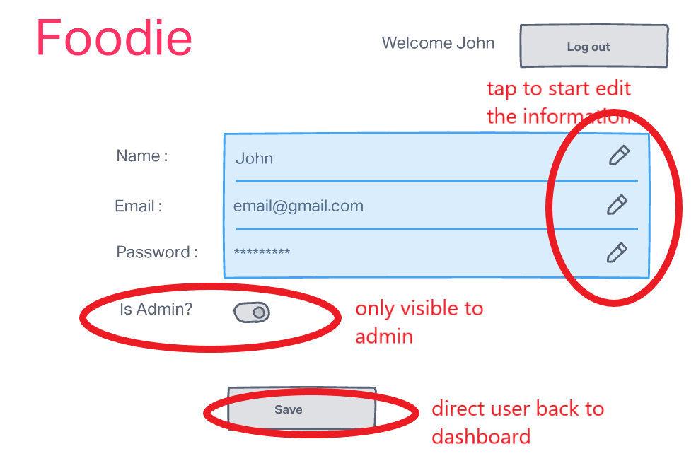
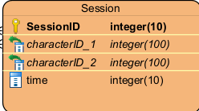
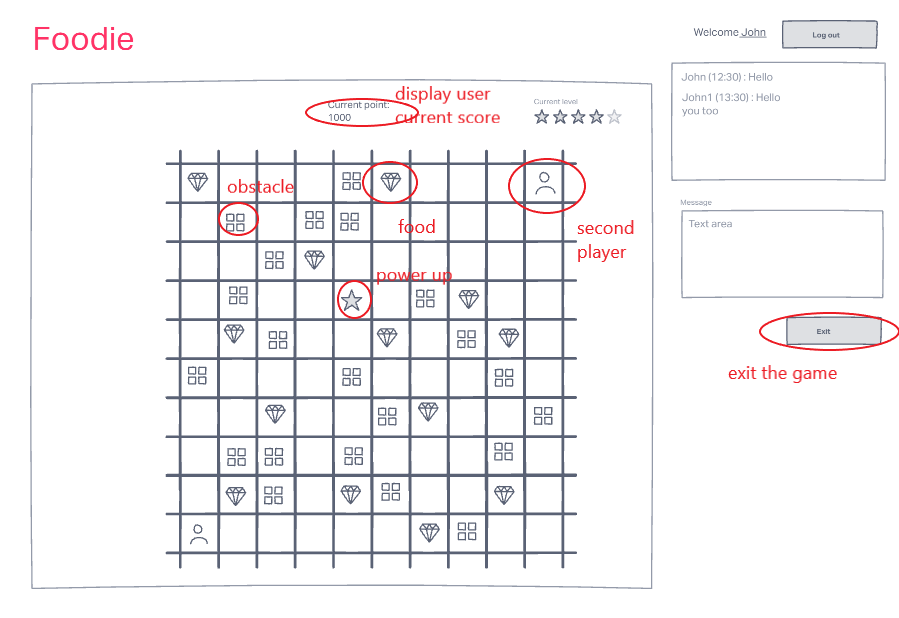
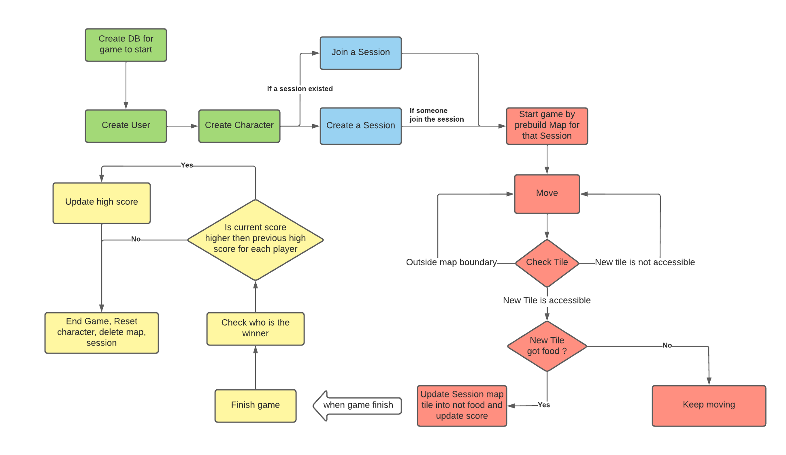

# DAT602-Final report

[TOC]

All the CRUD table is included as excel files in the `CRUD table` folder.

# Milestone 1

The game application (Foodie) follows the survival game with users who can compete for food and level up to increase the chance to survive and win other players.

## 1. User 

### 1.1 Register

Users will need to create an account to save their information for high scores and display names. The casual player will also be allowed to join without having a password but they will receive notification everytime they log in.

### 1.2 Login

Users can access their saved data with the correct username and password is provided or if the account dont have 

### 1.3 Edit

Users can choose to edit their current name or other information such as password, email(as long as it is not taken)

## 2. Admin

### 2.1 Access

Admin also log in as normal users, when the system checks if the user has `isAdmin: true` would be presented with a dashboard of the list of games, players as well other function to edit the system such as delete game, delete or edit users.

## 3. Game

### 3.1 Game logic

The game will be designed in a grid of 10x10 which is filled with obstacles and food to earn points and power up to improve the game experience. There will be 5 sets of maps with obstacles while the food and powerup will randomly spawn throughout the map. The points will calculate based on time taken to complete the level and food point user collected. The level can only be finished if the timer for the level like 2 minutes over or there are no more food on the board 

If user log out, the timer will stop while keeping the current stage status for the player, within 10s count down, if user didnt get back, they will lose the game and recieve the current points, the same goes with the winner.

Player can move only 1 block using arrow keys and receive food on the block but not passing though the obstables. The current power up would allow this increase the number of block they can move at one time, other power up is not available at this stage. Player can move on top of food, powerup, another user but not obstacles( may allow if future power up) 

The typeID will determine the type of block while locationID will hold the location of the tile on the map through value of column and row.

an example of a board might look like.

| food     |          |          | obstacle |          | food     |          | food     | obstacle |      |
| -------- | -------- | -------- | -------- | -------- | -------- | -------- | -------- | -------- | ---- |
|          | obstacle |          |          | obstacle |          |          |          |          |      |
|          |          | food     |          |          |          | food     |          |          |      |
| obstacle |          |          |          |          | food     |          | food     |          |      |
|          |          |          | food     | power up |          |          | obstacle |          |      |
|          | obstacle |          |          |          |          |          |          | food     |      |
|          |          |          |          | food     |          | obstacle |          |          |      |
|          |          |          | obstacle |          |          |          |          |          |      |
|          | obstacle | obstacle | food     |          | obstacle |          | food     |          |      |
| User     |          |          | obstacle |          |          |          |          |          |      |

### 3.2 Session

Creating a session for a game that takes in the ID of both players as well as the deadline of the game will contribute to scoring calculation as well as automatically delete the game if no one finished it

### 3.3 Character details

Players will have their character details updated after each move such as `locationID` if you move to a normal tile, `power_up` if they move to tile with power up property and so on. The character is link to user with `userID`, the data will be reset after the game finished or deleted if user is deleted

## 4. Chat

 The chat will display the latest 40 messages which display the userName, time and message content. The Chat will function as a global chat room which player can communicate with everyone.

## 5. Wireframe

### 5.1 Login

### 5.2 Register

### 5.3 Main Menu

add description

navigation on picture

### 5.4 User details

The toggle to allow user to become Admin only available if the current user is Admin. When admin want to change users details, the same interface will present

### 5.5 Admin.

### 5.6 Game

## 6. Logical entity relationship diagram

Based on the game design, with user

	

# Milestone 2

## Current logic (subject to change according to milestone)

   

The current CRUD Table is attached also with following updates :

- change the action to procedures name
- minor update on how the CRUD apply with each procedure

## 1. SQL Procedures and transactions

### 1.1 Player registration

To manage the player's authentication status, four procedures are created to handle different actions from players. 

#### 1.1.1 CreateUser

The procedure is created to allow users to create a new account to access the system, the CREATE action is only trigged if the email address does not exist in the `users` table yet and also allows further functions such as email and password validation. The created account will have all the default values attached to it for a regular user to start the game and can only be changed into admin by another admin.

#### 1.1.2 EditUSer

The procedure is created to allow the user to update their account detail at will, the procedure only started if a valid userID is given and is completed if the new given email is not occupied by another user.

#### 1.1.3 Logout User

The procedure is created to allow the user to log out of their account and change the login status of the account

#### 1.1.4 AuthUser

The procedure is created to allow registered users to log back into the game after logging out. First, it will check if the email exists within the database and then whether the user typed a wrong password or if the login attempt failed 3 times before locking out users to wait for an admin to reopen the account.                         

### 1.2 Player Selection

With the implementation of an authentication system, users can access the main function to create a game and join the game.

#### 1.2.2 CreateCharacter

After registering and accessing the game, the user will be able to create a character in the game to represent themselves, the character will handle the game function such as moving, calculating the score and having the data reset after each game. Furthermore, the character property can be expanded and allow further customisation, not limited to the name at the moment.

With a character created, users can start with creating a session or join a current session.

#### 1.2.2 Start a Session

If users create a game, they will be the first of a two-player session game and have the advantage of starting at the first block of the map. Users would create a game if they do not find any available game and wait for another player to join the game.

#### 1.2.3 Join a Session

If users decided to join a game, they will start at the other end of the map. When users join a full session they will be blocked as a Session can only contain 2 players by the game design.

Furthermore, when the session is full, the game will start automatically for the test purpose to introduce how the game will play out from start to finish 

#### 1.2.4 Prebuild Map

In order to make the game more robust and isolated, with each game session, there will be a dynamic table for the map created using dynamic SQL to update the change when players travel throughout the map without interfering with another player's session.

#### 1.2.5 Finish Game

The end function will be triggered when the timer from the `Join Session` procedure, the procedure will reset character information, delete the session map and session row as well as update the high score if the score of the character is higher than the current score. 

### 1.3 Live gameplay

It is also important to note that the game will be run on multiple threads with one thread handle the timer of the game and another handle live game actions with player movement.

#### 1.3.1  Move Position

The main gameplay procedure which allows players to change their position through the `positionID` update. Before the position update takes place, the new position will be checked if it is the boundary position then `Check Tile` will trigger to determine what type the new tile will be to determine if the position update is possible and if the score update would be trigged. 

#### 1.3.2 Check Tile Type

Check the type of Tile base on the map table, and return the `typeID` to determine the next action such as stopping the update if the tile is the wall or triggering `Get Food` procedure if the type contains food

#### 1.3.3 Get Food

When the character land on a food tile, the procedure will update the character score and update the dynamic map table to change the tile to a passible tile instead of Food,

### 1.4 Administrative Controls

#### 1.4.1 Delete User

The Admin user can delete the user from the system with `deleteUser` procedure if they seem fit.

#### 1.4.2 Delete Game Session

In case of a bug or error, the admin user can delete a game session with `deleteSession` procedure and allow the player to be unstuck.

#### 1.4.3 Create and update players

Using the same function with player registration but without the need to log in and log out to create a new account, Admin will be able to use those functions with the UI interface.

### 1.5 Further Functions

#### 1.5.1 Send Chat

The procedure allows players to send a message at a shared table which is served as a global chat room.

#### 1.5.1 CheckTime

An extra procedure which triggers the finish game function when a timestamp is reached is currently deployed to end the game as there is no player interaction yet. Furthermore, the function can act as a safeguard in case a player exits the game and failed to return or both players refuse to complete the game.

## 2. Multi-player support and ACID

### 2.1 Transactions

According to [databricks.com]( https://databricks.com/glossary/acid-transactions), a transaction is an operation that is treated as a single unit of work which can be completed or incomplete such as paying for an item at the store. In the same format, a database transaction is a set of operations on a database with the purpose of completing an action or process. An example of a transaction could be creating a game which required the presence of `Session`, `Characters`, `Map`, `Tile`, `Users` and can only start and finished with those table's information. If any information is missing the data will be incomplete and the game will never be finished.

### 2.2 The Importance of ACID

ACID stands for Atomicity, Consistency, Isolation, Durability

#### 2.2.1 Atomicity

According to the database.guide, the term means there are only two outcomes of a transaction, either success or failure, there is no success partly or half failed transaction. This aspect of the transaction ensures that the chain of actions leads to a certain outcome or reaches the end goal of the transaction. An example would be the procedure `GetFood`, if by getting the food, play get the point but the food doesn't disappear then the player can just get the same food and win the game without the need to distribute the food to the whole map.

#### 2.2.1 Consistency

According to the database.guide, consistency ensures that all data will be consistent and valid according to the rule set out by the database and developer. If the user wants to archive a goal or result from an action then the input needs to be correct and valid for the action to be completed.

#### 2.2.1 Isolation

According to the database.guide, all transactions will need to occur in isolation regardless of time or conditions and so that the transaction does not interfere with each other like in the example of the dynamic map created for the session to be updated after the user get the food on the map, this way when the dynamic map updated from one transaction, it will not alter or update the map of the different session.

#### 2.2.1 Durability

According to the database.guide, durability refers to the system's ability to contain the data even in case of a system crash and also retain the result of an action in the database. This aspect not only refers to backup data but also data on external hard drive which can deploy to prevent and reduce the damage from potential data loss. 

### 2.3 Multiplayer support

Following the design of Milestone 1, Foodie will only allow a game to start with 2 players by setting up the  `Session` to have 2 unique ID slot for characters and 2 separate procedures of `CreateSession` and `JoinSession` to ensure only players is presented at all time. Further, each session will have its own `Map` table to update after action so that any update on one Map will not change the data of a different map from another session and ensure the Isolation aspect of ACID. Further, the game is also set up with CheckTime to ensure the game will auto end when a timestamp is reached and reduce the chance of any inactive game within the system and further reinforce the Atomicity aspect of the database.

## 3. Reference

- Databricks. “What Are ACID Transactions?” Accessed May 18, 2022. https://databricks.com/glossary/acid-transactions.
- “What Does ACID Mean in Database Systems?” Accessed May 18, 2022. https://database.guide/what-is-acid-in-databases/.

# Milestone 3

